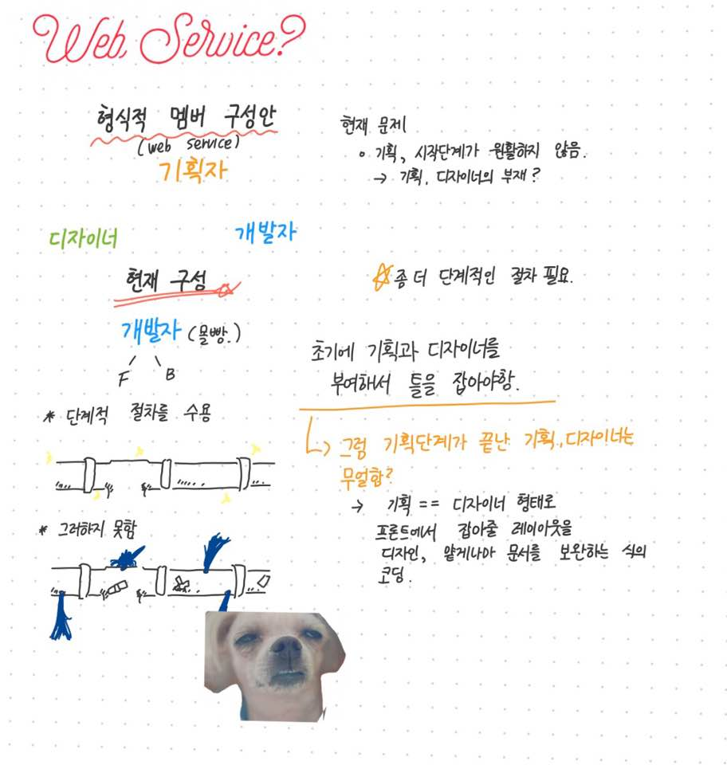

# 앞으로 Django 프로젝트는 좀 더 세분화해서 진행합니다.

* 디자이너, 기획자, 개발자 **세 구간**으로 역할을 분담해서 진행합니다. ( 기존 all 개발자 )

## 개인 추천 기획안(최은기)
| 
가
 | 
나
 | 
다
 |
|:---------|:---------:|---------:|
| **서비스 목적 및 형태 정의하기** | **스토리보드(메인페이지) 그리기** | **개발파트와 협의하기 (조건은 명확하고 냉정하게 끊어둘 것)** |

* 서비스 목적과 형태는 **기획자**를 **1-2명** 구성하여 진행하고 스토리보드는 **기획자**와 **디자이너**가 완성하는 것으로 합니다. ( 단, **기획자 == 디자이너** 일수도 있습니다. )
* **개발자**는 그 사이에 구현에 필요한 기술들에 대해 습득하거나, 자신이 수행해야하는 일에 대한 내용을 정리해둡니다.
+ **디자이너, 기획의 필수항목**
  + 포토샵 디자인 ( 필수 )
  + CSS ( 필수 )
  + html 문서에서 주로 쓰이는 몇몇 태그 ( 필수 )
  + 프론트개발자들과의 소통능력 ( "기획&디자이너":"갑", "프론트엔드":"을" )

##### 항상 벡엔드파트를 응원해주세요. 이들의 고충은 사춘기무렵, 아들을 바라보는 어머니의 마음과 같습니다.

## Members
김호규
엄민호
진형훈
최은기
김보승
안지우
박준형
안수연
최새롬
